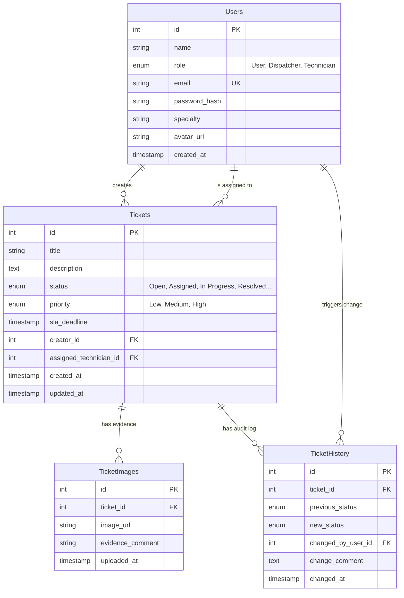

# FixIt Campus: Database Architecture & Setup

This document outlines the relational database schema for FixIt Campus. Our system uses **PostgreSQL 15** running inside a local Docker container to ensure environment consistency across the team.

## 1. Local Connection Credentials
To interact with the database during development, use a client like [[DBeaver](https://dbeaver.io/)](https://dbeaver.io/) or pgAdmin and connect with the following credentials:
* **Host:** `localhost`
* **Port:** `5432`
* **Database:** `sgm_db`
* **Username:** `admin`
* **Password:** `password123`

---

## 2. Entity-Relationship Diagram (ERD)
*The following diagram maps the relationships between our core entities, including the strict foreign key constraints that tie evidence and audit logs to specific tickets.*

---

## 3. Core Tables & Responsibilities

1. **`Users`**: Centralized table for all personnel. Uses Role-Based Access Control (RBAC) via the `role` ENUM to differentiate between standard users reporting issues, dispatchers assigning them, and technicians resolving them.
2. **`Tickets`**: The core operational entity. Tracks the lifecycle of a maintenance request. It maps to two separate users (the creator and the assigned technician) to establish accountability.
3. **`TicketImages`**: Extracted into a separate table (1-to-Many relationship with Tickets) to allow technicians to upload multiple photographic proofs of a single repair.
4. **`TicketHistory`**: An immutable audit log. Every time a ticket changes state, a trigger or backend controller will write a record here. This guarantees transparency and prevents "ghost" ticket closures.

---

## 4. Initialization & Seeding (For Developers)

When you spin up the Docker environment (`docker compose up -d`) for the first time, your local database is completely empty.

To populate it with our official tables and mock data:
1. Open DBeaver and connect to `sgm_db`.
2. Locate the **`schema.sql`** file in the repository (under `/backend/database/`).
3. Execute the entire script to create the tables, relationships, and ENUMs.
4. Open the **`seed.sql`** file and execute it to populate the database with dummy users and test tickets.

*(Note: The `seed.sql` file contains a `TRUNCATE` command at the top, meaning you can run it as many times as you want without creating duplicate records during testing).*